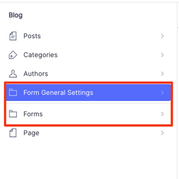

# Sanity Contact Form Plugin

A customizable contact form plugin for Sanity Studio, with seamless integration in your Next.js frontend.

---

## Features

- Create multiple forms with flexible field types
- Define global settings (admin email, reCAPTCHA, confirmation messages, etc.) via a singleton document
- Fully functional Next.js integration
- API endpoints to handle submissions and send emails
- Field types supported: text, textarea, select, checkbox, radio, file upload, etc.
- Google reCAPTCHA support
- Email notifications to admin using Gmail SMTP
- Customizable success and confirmation messages

---

## Form Configuration

### 1. General Settings (Singleton)

Configure the following global settings in Sanity Studio:

- **Admin Email**: Recipient for form submissions
- **Gmail SMTP Settings**: Email and App password for authentication
- **Success Message**: Message shown after successful submission
- **Confirmation Subject & Message**: For user confirmation emails
- **reCAPTCHA Settings**: Enable/disable, set site and secret keys

### 2. Form Creation

While creating a form in Sanity, you can:

- Set form title and visibility
- Add multiple field types: Text, Email, Select, Radio, Checkbox, File upload
- Configure field-specific settings: Required, Placeholder, Help text, Note
- Set custom submit button text

---

## Plugin Dependencies

Install required packages:

```bash
# Google reCAPTCHA
npm install react-google-recaptcha
npm install --save-dev @types/react-google-recaptcha

# Nodemailer
npm install nodemailer
npm install --save-dev @types/nodemailer
```

---

## Plugin Installation (Studio)

Install the plugin in your Sanity Studio:

```bash
cd your-studio
npm install @multidots/sanity-plugin-contact-form
```

Register it in `sanity.config.ts`:

```ts
import { contactFormPlugin } from '@multidots/sanity-plugin-contact-form';

export default defineConfig({
  plugins: [contactFormPlugin()],
});
```

---

## Schema Setup

### 1. `formGeneralSettings` Singleton

Use this structure in your `structure.ts` to make the settings document singleton:

```js
S.listItem()
  .title('Form General Settings')
  .child(
    S.editor()
      .schemaType('formGeneralSettings')
      .documentId('form-general-settings')
  )
```

Filter out the form settings from the main document list:

```js
...S.documentTypeListItems().filter(
  (item) =>
    item.getId() &&
    !["formGeneralSettings"].includes(item.getId()!)
),
```

### 2. Page Schema Field

Add the following field to your page schema:

```ts
defineField({
  name: 'contactForm',
  title: 'Contact Form',
  type: 'reference',
  to: [{ type: 'contactForm' }],
  description: 'Select a contact form to display.',
}),
```

Update your page query to include the `contactForm` field and generate schema.

---

## Sanity Queries

Add the following to `queries.ts` in your `sanity/lib/` directory:

```ts
export const CONTACT_FORM_QUERY = `*[_type == "contactForm" && _id == $formId]{
  title,
  showtitle,
  _id,
  id,
  class,
  fields[]{
    label,
    name,
    type,
    isRequired,
    helpText,
    note,
    showPlaceholder,
    selectOptions,
    placeholder,
    radioOptions,
    checkboxOptions,
    options[]{
      value,
      label
    },
  },
  submitButtonText
}[0]`;

export const CONTACT_FORM_SETTINGS_QUERY = `*[_type == "formGeneralSettings"][0]{
  adminEmail,
  successMessage,
  confirmationSubject,
  confirmationMessage,
  recaptchaEnabled,
  recaptchaSiteKey,
  recaptchaSecretKey,
  smtpUsername,
  smtpPassword
}`;
```

---

##  API Route (Next.js)

Create the file below in your Next.js app:  
`src/app/api/submit-form/route.ts`

<details>
<summary>Click to expand full code</summary>

```ts
import { NextResponse } from 'next/server'
import { client } from '@/sanity/lib/client'
import nodemailer from 'nodemailer'

import { NextResponse } from 'next/server'
import { client } from '@/sanity/lib/client'
import nodemailer from 'nodemailer'

async function uploadResume(file: File): Promise<{ _type: "file"; asset: { _type: "reference"; _ref: string } }> {
  const asset = await client.assets.upload('file', file, {
    filename: file.name,
    contentType: file.type,
  });

  return {
    _type: "file",
    asset: {
      _type: "reference",
      _ref: asset._id,
    }
  };
}

async function sendEmailWithAttachment(emailData: {
  formData: { [key: string]: string }
  mailSettings: Record<string, unknown>
}) {
  try {
    const { formData, mailSettings } = emailData;
    const resumeUrl = formData.resume;
    const fileName = resumeUrl?.split('/').pop();
    const attachments = [];

    if (resumeUrl) {
      let absoluteUrl = resumeUrl;
      if (!/^https?:\/\//i.test(resumeUrl)) {
        absoluteUrl = `https://${resumeUrl}`;
      }

      const fileBuffer = await fetch(absoluteUrl).then(res => res.arrayBuffer());
      attachments.push({
        filename: fileName || 'resume.pdf',
        content: Buffer.from(fileBuffer),
        contentType: 'application/pdf',
      });
    }

    const tableRows = Object.entries(formData)
      .filter(([key]) => key !== 'resume' && key !== 'settings')
      .map(([key, value]) => {
        return `
          <tr>
            <td style="padding: 8px; border: 1px solid #ccc;"><strong>${key}</strong></td>
            <td style="padding: 8px; border: 1px solid #ccc;">${value}</td>
          </tr>
        `;
      })
      .join('');

    const htmlContent = `
      <p>${mailSettings.confirmationMessage}</p>
      <table style="border-collapse: collapse; width: 100%; margin-top: 16px;">
          ${tableRows}
      </table>
      ${resumeUrl ? `<p>Resume attached: ${fileName}</p>` : ''}
    `;

    const transporter = nodemailer.createTransport({
      service: 'Gmail',
      auth: {
        user: mailSettings.smtpUsername as string,
        pass: mailSettings.smtpPassword as string,
      },
    });

    await transporter.sendMail({
      from: 'Contact Form' + (mailSettings.smtpUsername ? ` <${mailSettings.smtpUsername}>` : ''),
      to: mailSettings.adminEmail as string,
      subject: typeof mailSettings.confirmationSubject === 'string' ? mailSettings.confirmationSubject : undefined,
      html: htmlContent,
      attachments,
    });

    return { success: true };
  } catch (error) {
    console.error('Email sending error:', error);
    throw error;
  }
}

export async function POST(request: Request) {
  try {
    const formData = await request.formData();

    // Early extraction of settings and recaptchaToken
    const settingsString = formData.get('settings') as string;
    const mailSettings = settingsString ? JSON.parse(settingsString) : {};
    const recaptchaToken = formData.get('recaptchaToken') as string;

    // Verify reCAPTCHA first if enabled in settings
    if (mailSettings.recaptchaEnabled && mailSettings.recaptchaSecretKey) {
      if (!recaptchaToken) {
        return NextResponse.json({
          success: false,
          recaptchaSuccess: false,
          message: 'reCAPTCHA token missing'
        }, { status: 400 });
      }

      const verificationUrl = `https://www.google.com/recaptcha/api/siteverify?secret=${mailSettings.recaptchaSecretKey}&response=${recaptchaToken}`;
      const recaptchaResponse = await fetch(verificationUrl, { method: 'POST' });
      const recaptchaData = await recaptchaResponse.json();

      if (!recaptchaData.success) {
        return NextResponse.json({
          success: false,
          recaptchaSuccess: false,
          message: 'reCAPTCHA verification failed'
        }, { status: 400 });
      }
    }

    // Process form data
    const formDetails: Record<string, string | File | (string | File)[]> = {};
    const fileFields: Record<string, File> = {};

    formData.forEach((value, key) => {
      if (key === 'settings' || key === 'recaptchaToken' || key === 'recaptcha') return;

      if (value instanceof File) {
        if (value.name) {
          fileFields[key] = value;
        }
        return;
      }

      if (formDetails[key]) {
        if (Array.isArray(formDetails[key])) {
          (formDetails[key] as unknown[]).push(value);
        } else {
          formDetails[key] = [formDetails[key], value];
        }
      } else {
        formDetails[key] = value;
      }
    });

    // Handle resume file upload if present
    // Dynamically find the first file field (if any)
    const fileFieldKey = Object.keys(fileFields)[0];
    const resumeFile = fileFieldKey ? fileFields[fileFieldKey] : undefined;
    const resumeFileRef = (resumeFile instanceof File && resumeFile.name)
      ? await uploadResume(resumeFile)
      : null;

    // Prepare email data
    const emailFormData: Record<string, string> = {};
    formData.forEach((value, key) => {
      if (key === 'settings' || key === 'recaptchaToken' || key === 'recaptcha') return;

      if (typeof value === 'string') {
        emailFormData[key] = value;
      }
    });

    // Add resume URL if available
    if (resumeFileRef?.asset._ref) {
      const assetRef = resumeFileRef.asset._ref;
      if (assetRef.startsWith('file-')) {
        const parts = assetRef.split('-');
        const fileId = parts[1]; // The hash is always the second part
        const ext = parts[2]; // The extension is always the third part
        const resumeFileUrl = `https://cdn.sanity.io/files/${process.env.NEXT_PUBLIC_SANITY_PROJECT_ID}/${process.env.NEXT_PUBLIC_SANITY_DATASET}/${fileId}.${ext}`;
        emailFormData['resume'] = resumeFileUrl;
      }
    }
    // Send confirmation email
    await sendEmailWithAttachment({
      formData: emailFormData,
      mailSettings: mailSettings
    });

    return NextResponse.json({ 
      success: true, 
      message: 'Form submitted and email sent successfully' 
    }, { status: 200 });

  } catch (error) {
    console.error('API Error:', error);
    return NextResponse.json({
      success: false,
      message: 'Failed to submit form',
      error: error instanceof Error ? error.message : 'Unknown error'
    }, { status: 500 });
  }
}
```

</details>

**This file:**

- Handles form submission
- Sends confirmation and admin emails via Gmail (using Nodemailer)
- Uploads file attachments to Sanity
- Verifies Google reCAPTCHA (if enabled)

Full code is included above — no changes required.

---

##  Environment Variables

Add these to your `.env.local` in your Next.js app:

```env
NEXT_PUBLIC_SANITY_PROJECT_ID=your_project_id
NEXT_PUBLIC_SANITY_DATASET=production
NEXT_PUBLIC_SANITY_WRITE_TOKEN=your_sanity_token
```

Make sure `client.ts` uses `NEXT_PUBLIC_SANITY_WRITE_TOKEN` for write permissions (e.g., file uploads):

```ts
export const client = createClient({
  // …other code
  token: clientEnv.NEXT_PUBLIC_SANITY_WRITE_TOKEN,
});
```

---

##  React Component Integration

### 1. Create the Wrapper component

`src/components/ContactFormWrapper.tsx`:

```tsx
'use client';

import { ContactForm } from '@multidots/sanity-plugin-contact-form';

export function ContactFormWrapper({ formData }: { formData: any }) {
  return <ContactForm formData={formData} />;
}
```

### 2. Use in Page

In your `page.tsx` file, render the form on the frontend:

```tsx
import { sanityFetch } from "@/sanity/lib/live";
import { PAGE_QUERY, CONTACT_FORM_QUERY, CONTACT_FORM_SETTINGS_QUERY } from "@/sanity/lib/queries";
import { client } from '@/sanity/lib/client';
import { ContactFormWrapper } from '@/components/ContactFormWrapper';

type RouteProps = {
  params: Promise<{ slug: string }>;
};

const getPage = async (params: RouteProps["params"]) =>
  sanityFetch({
    query: PAGE_QUERY,
    params: await params,
  });

export default async function Page({ params }: RouteProps) {
  const { data: page } = await getPage(params);
  const formId = page?.contactForm?._ref;
  const formData = formId ? await getContactForm(formId) : null;

  return (
    <>
      <ContactFormWrapper formData={formData} />
    </>
  );
}

async function getContactForm(formId: string) {
  try {
    const [formData, formSettings] = await Promise.all([
      client.fetch(CONTACT_FORM_QUERY, { formId }),
      client.fetch(CONTACT_FORM_SETTINGS_QUERY),
    ]);

    return { ...formData, settings: formSettings };
  } catch (error) {
    console.error("Error fetching contact form:", error);
    throw error;
  }
}
```

<!-- ## Screenshots

Here are some screenshots of the plugin settings:

 -->


---

With this setup, your contact forms are completely managed in Sanity and rendered in your Next.js app with API-powered submission and email handling.
